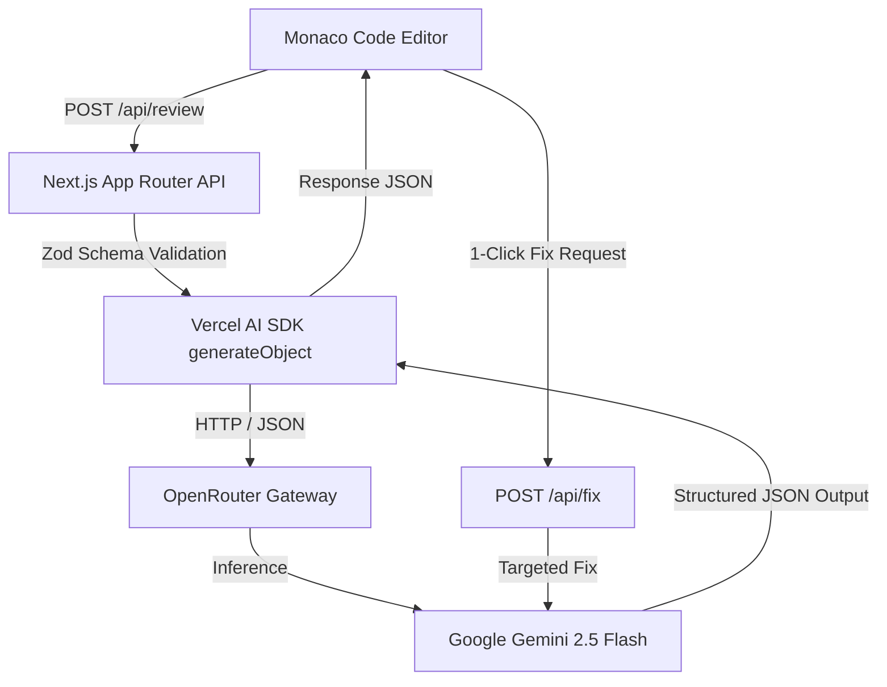

# 🛠️ Technical Design Document (TDD)

## Project Name: AI Code Reviewer Architecture
**Stack:** Next.js 16 (App Router + Turbopack), TypeScript 5, Vercel AI SDK v4, OpenRouter, Monaco Editor, Zod.

---

## 🏗️ High-Level System Architecture



---

## 📡 API Endpoints & Structured Output Schemas

### 1. `POST /api/review`

#### Request Body
```json
{
  "code": "function twoSum(nums, target) { ... }",
  "language": "javascript",
  "style": "complexity" // 'friendly' | 'strict' | 'complexity' | 'architect'
}
```

#### Zod Output Schema Definition (`reviewSchema`)
```typescript
export const reviewSchema = z.object({
  issues: z.array(
    z.object({
      line: z.number().describe('1-based line number'),
      severity: z.enum(['critical', 'warning', 'info']),
      description: z.string().describe('Actionable issue explanation')
    })
  ),
  suggestions: z.array(z.string()),
  score: z.number().min(1).max(10),
  time_complexity: z.string().describe('e.g. O(N²) -> O(N)'),
  space_complexity: z.string().describe('e.g. O(N) -> O(1)'),
  complexity_analysis: z.string(),
  refactored_code: z.string()
});
```

---

### 2. `POST /api/fix`

#### Request Body
```json
{
  "code": "const query = 'SELECT * FROM users WHERE id = ' + id;",
  "language": "javascript",
  "issue": {
    "line": 1,
    "severity": "critical",
    "description": "SQL Injection vulnerability"
  },
  "style": "architect"
}
```

#### Zod Output Schema Definition (`fixSchema`)
```typescript
const fixSchema = z.object({
  fixed_code: z.string().describe('Raw corrected code snippet'),
  explanation: z.string().describe('Concise 1-2 sentence explanation')
});
```

---

## ⚡ Performance Optimizations & Error Resilience

1. **Model Selection Optimization (`src/lib/ai.ts`):**
   * Configured `google/gemini-2.5-flash` for review and fix endpoints.
   * Eliminates extended-reasoning gateway timeouts ($> 120\text{s}$) from OpenRouter while preserving 100% structured JSON compliance.
2. **Type Safety & Lint Compliance:**
   * Replaced raw `catch (error: any)` with safe `catch (error: unknown)` error bounds across API routes and client page components.
   * Handled language preset state synchronization inline via event handlers rather than calling `setState` inside `useEffect`, complying with React 19 compiler hooks guidelines.
